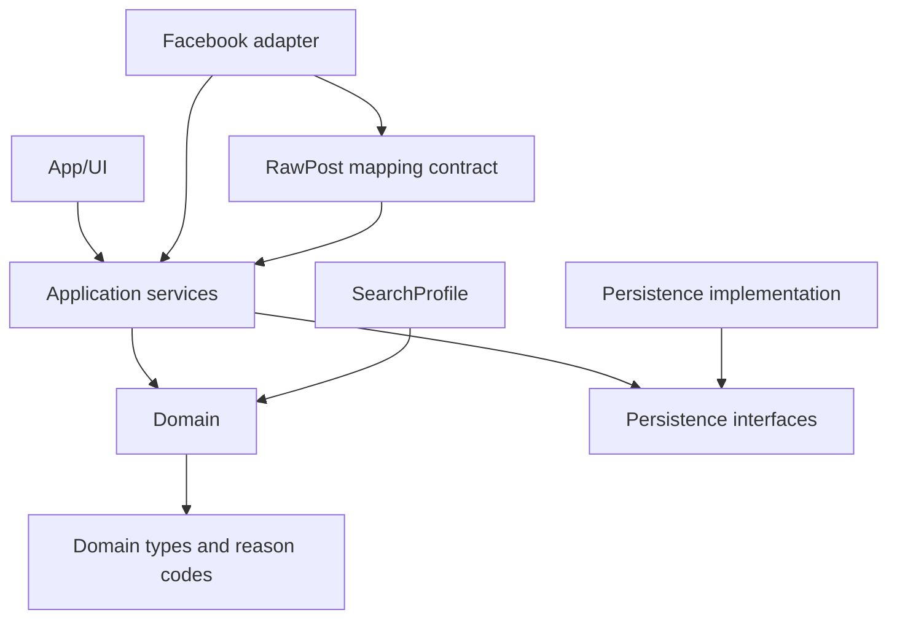

# Code Graph

Tai lieu nay mo ta graph kien truc muc tieu, module boundaries va dependency direction. Phase 2 da co Go domain types toi thieu nhung chua gia dinh codebase-memory-mcp/codegraph da duoc cau hinh va khong tu cai tool.

## Mermaid dependency graph



## Module ownership

- `cmd/scanfb`: binary entry point toi thieu.
- `internal/domain`: Go package cho domain ownership.
- `internal/application`: Go package cho application service ownership.
- `internal/rules`: Go package cho deterministic buyer rules ownership.
- `internal/dedup`: Go package cho deduplication ownership.
- `internal/persistence`: Go package cho persistence boundary ownership.
- `internal/facebook`: Go package cho Facebook/browser adapter boundary ownership.
- `internal/ui`: Go package cho presentation boundary ownership.
- App/UI: owner cua views, tabs, lead cards, settings va user actions.
- Application services: owner cua scan orchestration, batch state, time window va transaction flow.
- Domain: owner cua normalization contracts, SearchProfile, BuyerIntentClassifier, rule engine, geographic classifier, deduplication, lead aggregation va reason codes.
- Persistence interfaces: owner cua repository contracts.
- Persistence implementation: owner cua local storage implementation.
- Facebook adapter: owner cua page reading, DOM parsing va fail-closed adapter errors.

Phase 2 files trong `internal/domain` gom minimal models cho `RawPost`, `AuthorIdentity`, `SearchProfile`, `GeographicMode`, `ScanWindow` va `ScanRequest`. Domain package chi duoc import Go standard library.

## Allowed dependencies

- App/UI duoc goi Application services.
- Application services duoc goi Domain va Persistence interfaces.
- Persistence implementation duoc implement Persistence interfaces.
- Facebook adapter duoc goi Application services bang adapter boundary.
- Tests duoc import Domain truc tiep de chay fixture deterministic.

## Forbidden dependencies

- Domain khong duoc import App/UI.
- Domain khong duoc import Facebook adapter.
- Domain khong duoc chua CSS selector, DOM traversal, browser automation hoac Facebook-specific parsing.
- Facebook adapter khong duoc chua buyer business rules hoac product-specific extraction.
- UI khong duoc tu quyet dinh include/exclude thay rule engine.
- Persistence implementation khong duoc dieu khien browser.
- Khong module nao trong ScanFB duoc them seller mode, `SellerLead`, `SellerIntentClassifier`, `LeadIntent` buyer/seller hoac `SELLER_SCAN`.

## Entry points

- User bam Scan: App/UI goi Application service tao `ScanSession` va `ScanBatch`.
- User mo lead: App/UI mo canonical post URL tu `LeadSource`.
- User danh dau status: App/UI goi Application service cap nhat `LeadStatus`.
- User bo qua account: App/UI goi Application service tao `BlockedAuthor`.
- Facebook adapter: application service kich hoat adapter doc group hien tai trong batch.

## Data flow cho Scan batch

```text
User Scan
-> App/UI
-> Application services tao ScanSession voi startedAt va geographicMode
-> Gan built-in MacBook SearchProfile trong MVP
-> Chon dung 5 WatchedGroup cho ScanBatch
-> Voi tung group: GroupScanAttempt pending -> running
-> Facebook adapter doc page va tao RawPost
-> Application services dua RawPost vao domain pipeline
-> Luu RawPost, FilterDecision, Lead/LeadSource
-> GroupScanAttempt succeeded/failed/skipped/expired_at_day_boundary
-> Batch summary tra ve UI
```

## Data flow cho filter/dedup

```text
RawPost
-> Normalization
-> Author rules
-> Blocklist rules
-> SearchProfile target keyword matching
-> BuyerIntentClassifier
-> Geographic classification
-> FilterDecision + FilterReason
-> PostDeduplicator fingerprint
-> Buyer lead aggregation
-> LeadSource append hoac Lead moi
```

## SearchProfile va buyer-only boundary

MVP chi co built-in MacBook Search Profile. Graph duoc giu trung lap cho phan scan/post/author/geo/dedup de sau nay co the them buyer Search Profile khac, nhung khong bien Phase hien tai thanh framework da san pham.

App tim nguoi can ban, neu co trong tuong lai, la du an/app khac. ScanFB hien tai khong co seller tab, seller mode selector, seller classifier hay enum intent buyer/seller.

## Cap nhat code graph khi code thay doi

Khi bat dau co code, moi thay doi module boundary phai cap nhat tai lieu nay neu:

- Them module moi.
- Doi dependency direction.
- Them entry point moi.
- Doi pipeline scan/filter/dedup.
- Them persistence hoac adapter implementation moi.

Khong cap nhat graph de hop thuc hoa dependency bi cam. Neu code can dependency bi cam, phai sua design hoac xin quyet dinh san pham/kien truc truoc.

## Huong dan dung codebase-memory-mcp/codegraph ve sau

Neu project sau nay duoc cau hinh codebase-memory-mcp hoac CodeGraph:

- Dung graph tools de tim symbol, module boundary va call path truoc khi grep.
- Dung grep/file search cho string literal, config, markdown hoac khi graph chua co ket qua.
- Khong tu cai, khoi tao hoac rebuild tool trong milestone khong cho phep.
- Khong gia dinh graph da dung neu `.codegraph/` hoac cau hinh MCP khong ton tai.
